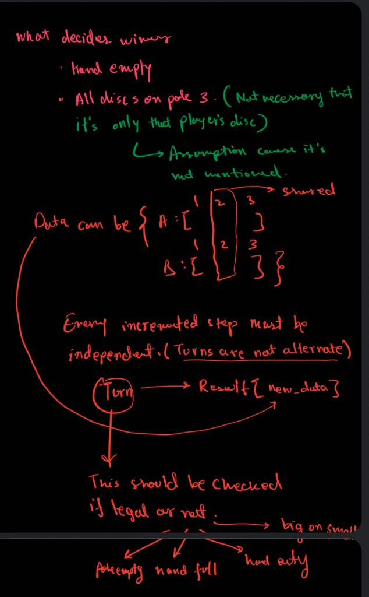
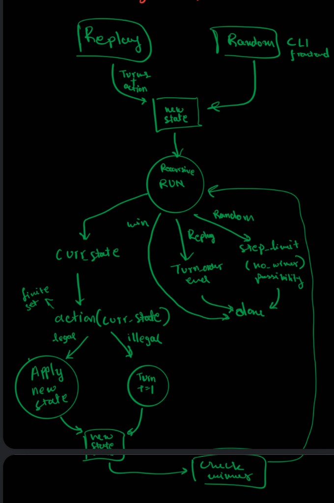
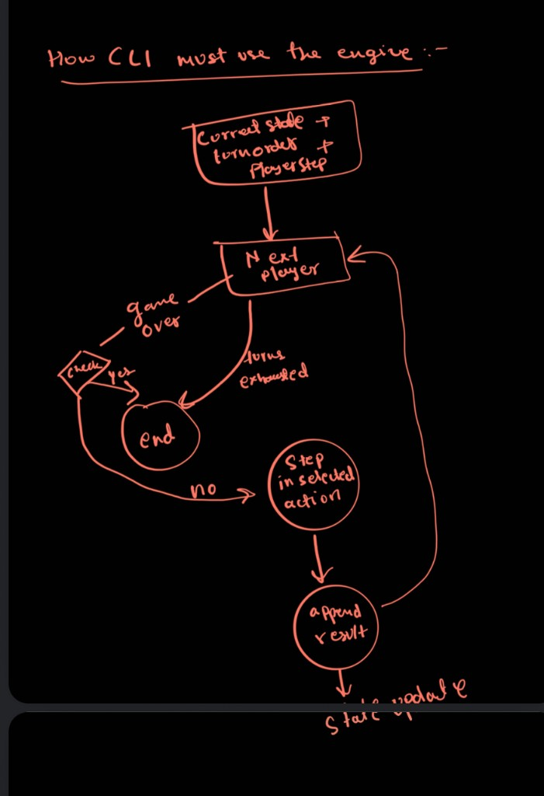

Early requirements:
1. we will need a state and action and why those action might or might not be possible(illegal moves) for RL type usage 
2. post action we need to see the state again.
3. winner is also possible when all discs on it's pole 3 is not their own

Design decisions:
1. Will be storing stack in a pole in () tuple
2. {A1:(),B1:(),SHARED:(),A3:(),B3:()} state storage
3. Will have Observation + CurrentState -> might merge into one but we must not since gamestate can show the other player's hand so someone can invoke it and cheat.
4. example current state  when  player A lifts disk 1 (n=2)
{"n": 2, "turn": 1,
 "poles": {"A1": [3], "B1": [4, 2], "SHARED": [], "A3": [], "B3": []},
 "hands": {"A": 1, "B": null},
 "winner": null, "over": false}

5. there will be some end state contraint : turns over or steps max limit reached

6. I am going to assume that we will only generate valid moves in case of random moves hence the random moves cannopt be generated at the start rather they have to be generated from check the set of actions that are valid after t turns at time t+1

7. I initially considered max turn exhausted as an illegal move but that is a state that chnages ona  run time basis adn isnt fixed hence can't be considered as a part of an illegal move which in my opinion should be a fixed space

Where AI was significantly used in engine:

1. Used composer to write the next step function. opus 5.5 medium 

prompt : I need to create the nextStep func basuically moving we will be return the turnresult in it.
any player can have any turn at any time. you can chekc the action by calling on observing that action def observe(self, player):.
if it is nont None or actionn is a skip then we will return self unchnaged else we will replace the turn wil self.turn +1  adn rest same  in the turn result 
do similar for when legal 
2. also fixed bugs in my code in engine 

3. converting class results to dict so need not import class everytime (to dict and from dict)

Where AI was significantly used in cli :

1. Used cursor to help build the functions around the play function 

prompt : Build me a the util functions to run random games which send next player and action (in case of replay will be decided by input adn in case of random a random move generator must generate it). view the dag i pasted of the play func and see the function to then build around it. also as we only want valid moves in random generator we will only create the moves when we know the current state which can be found using observation.check_state with the new action (all the possible actions a player can take is mentioend in engine ACTIONS).  
ask for run type in cli argsparse (replay or random) and for replay ask for a json file adn for random there must be number of dics , max steps. Make it so that i can run the game via hanoi-crossing + args in cli

# TESTS I ran

hanoi-crossing replay game_test_replay.json
{
  "winner": null,
  "stop_reason": "turn_order_exhausted",
  "turns_played": 3,
  "illegal_actions": {
    "A": 0,
    "B": 0
  },
  "final_state": {
    "n": 1,
    "turn": 3,
    "poles": {
      "A1": [],
      "B1": [
        2
      ],
      "SHARED": [],
      "A3": [],
      "B3": []
    },
    "hands": {
      "A": 1,
      "B": null
    },
    "winner": null,
    "over": false
  },
  "unused_moves": {
    "A": 0,
    "B": 0
  }
}

hanoi-crossing random -n 4 --seed 42
{
  "seed": 42,
  "winner": "A",
  "stop_reason": "won",
  "turns_played": 944,
  "illegal_actions": {
    "A": 0,
    "B": 0
  },
  "final_state": {
    "n": 4,
    "turn": 597,
    "poles": {
      "A1": [],
      "B1": [
        8
      ],
      "SHARED": [],
      "A3": [
        5,
        4,
        1
      ],
      "B3": [
        6,
        3,
        2
      ]
    },
    "hands": {
      "A": null,
      "B": 7
    },
    "winner": "A",
    "over": true
  }
}
❯ hanoi-crossing random -n 4 --seed 46
{
  "seed": 46,
  "winner": "A",
  "stop_reason": "won",
  "turns_played": 509,
  "illegal_actions": {
    "A": 0,
    "B": 0
  },
  "final_state": {
    "n": 4,
    "turn": 325,
    "poles": {
      "A1": [],
      "B1": [
        8,
        4
      ],
      "SHARED": [],
      "A3": [
        5,
        3
      ],
      "B3": [
        6,
        2,
        1
      ]
    },
    "hands": {
      "A": null,
      "B": 7
    },
    "winner": "A",
    "over": true
  }
}

# Screen capture of creation of engine 
https://drive.google.com/drive/folders/1aBnte7ShTOdmDdVh5eBVVV_dqH3OViVd?usp=sharing

I have left the readme not AI edited as they were the raw thought process.